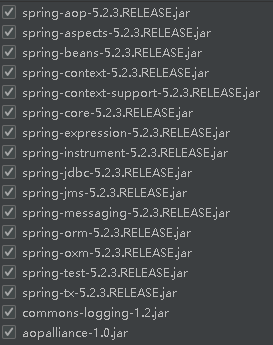
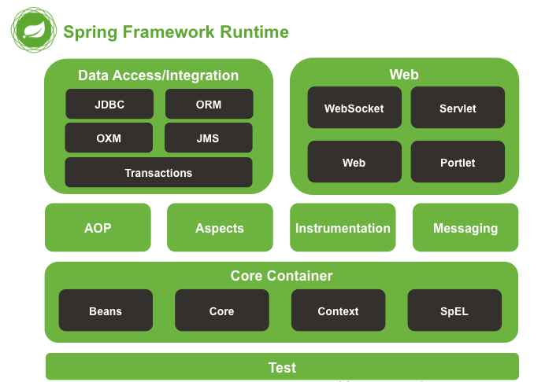

# Spring复习

## 1、Spring简介

### 1.1、Spring 5.2.3的17个jar包

### 1.2、Spring架构图

### 1.3、Spring 各个jar的作用

Beans：Spring IOC的基础实现，包含访问配置文件、创建和管理bean等。

Core：Spring的核心工具包

Context：在基础IOC功能上提供扩展服务

Expression：Spring表达式语言

AOP：Spring的面向切面编程，提供AOP（面向切面编程）的实现

Aspects：模块提供了与 AspectJ 的集成，这是一个功能强大且成熟的面向切面编程（AOP）框架

Web：包含Web应用开发时，用到Spring框架时所需的核心类

JDBC：对JDBC 的简单封装

ORM：整合第三方的orm实现，如hibernate，ibatis，jdo以及spring 的jpa实现

Transaction：为JDBC、Hibernate、JDO、JPA等提供的一致的声明式和编程式事务管理

### 1.4、Spring重要概念

#### 1.4.1、Ioc

Ioc—Inversion of Control，即“控制反转”，不是什么技术，而是一种设计思想。在Java开发中，Ioc意味着将你设计好的对象交给容器控制，而不是传统的在你的对象内部直接控制。

- 谁控制谁，控制什么：传统Java SE程序设计，我们直接在对象内部通过new进行创建对象，是程序主动去创建依赖对象；而IoC是有专门一个容器来创建这些对象，即由Ioc容器来控制对 象的创建；谁控制谁？当然是IoC 容器控制了对象；控制什么？那就是主要控制了外部资源获取（不只是对象包括比如文件等）。
- 为何是反转，哪些方面反转了：有反转就有正转，传统应用程序是由我们自己在对象中主动控制去直接获取依赖对象，也就是正转；而反转则是由容器来帮忙创建及注入依赖对象；为何是反转？因为由容器帮我们查找及注入依赖对象，对象只是被动的接受依赖对象，所以是反转；哪些方面反转了？依赖对象的获取被反转了。

目的：减低代码耦合性

### 1.4.2、DI

DI—Dependency Injection，由容器动态的将某个依赖关系注入到组件之中。依赖注入的目的并非为软件系统带来更多功能，而是为了提升组件重用的频率，并为系统搭建一个灵活、可扩展的平台。

## 2、Spring中的bean

### 2.1、bean的作用域

singleton（默认）：在这个spring容器中建立一次这个bean的对象，则会一直存在，即使新建也不会改变。

验证方法：getBean（）方法调用两次，且调用同一对象。结果两个地址相同。

prototype：每次定义bean都会新建一个对象实例

验证方法：getBean（）方法调用两次，且调用同一对象。结果两个地址不同。

request：用于web中，每个request用一个对象实例

session：用于web中，每个session用一个对象实例‘

globalSession：作用和session类似，只是使用portlet的时候使用。（portlet是个web组件）

### 2.2、Spring的三种注入方式

构造方法注入、set方法注入、属性注入

### 2.3、Spring常用注解

@Component

@Controller

@ Service

@ Repository

@Autowired

